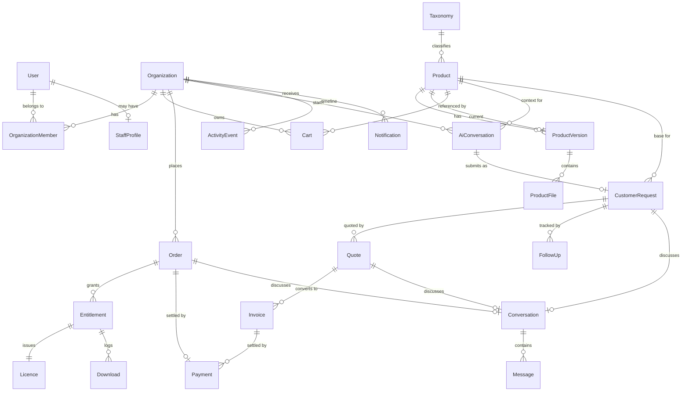

# Domain model — MVP

Refines §78's ~45 conceptual entities down to the **26 collections** the MVP
needs. Post-MVP entities (projects, milestones, tickets, subscriptions,
renewals, sandboxes, tech-assistant hours) are deliberately absent — see the
scope boundary in `ai-contexts/01-mvp-todo.md`.

Companion files:
- `INTEGRITY.md` — what enforces each reference, since Mongo has no foreign keys
- `STATES.md` — generated from `states.ts`; the transition maps
- `enums.ts` — the single source of truth for every status value

## Embed vs reference

The rule applied throughout:

| Decision | When | Examples |
|---|---|---|
| **Embed** | Read with the parent, owned by it, bounded in size | product media, features, prices, licence packages, add-ons, order lines, quote line items, AI messages |
| **Reference** | Queried independently, or grows without bound | orders, entitlements, requests, invoices, payments, messages, activity |
| **Snapshot** | Crosses a service boundary and must survive the source changing | order lines, invoice lines, base-product version on a request |

The snapshot row is the one that matters most. §61 forbids re-deriving an old
order total from current prices, so an order line embeds the product name,
version, licence terms and price *as they were at purchase*.

## Diagram



## Collections

### Identity & tenancy
| Collection | Notes |
|---|---|
| `users` | Better Auth owns credentials; this carries profile + `isStaff`. |
| `organizations` | Every customer resource belongs to one (§76). Solo customers get a personal org. |
| `organizationMembers` | Unique on `(organizationId, userId)`. |
| `staffProfiles` | `roles: StaffRole[]` — permissions are their union (§77). |

### Catalog
| Collection | Notes |
|---|---|
| `taxonomies` | One collection, four `kind`s. Slug unique **per kind**. |
| `products` | Embeds media, features, prices, licence packages, add-ons, demo config, customisation config, testing checklist. |
| `productVersions` | `releasedAt` anchors the entitlement update window. |
| `productFiles` | Unguessable storage keys; never public URLs (§44, §66). |

### Commerce
| Collection | Notes |
|---|---|
| `carts` | One currency per cart. TTL-swept on `expiresAt`. |
| `orders` | Fully snapshotted lines (§61). |
| `payments` | Unique on `(provider, providerRef)` — the webhook idempotency key. |
| `webhookEvents` | Unique on `(provider, eventId)`; raw payload retained. |
| `entitlements` | Unique on `(orderId, orderLineId)` — makes fulfilment idempotent. |
| `licences` | Unique `key`, unique `entitlementId`. |
| `downloads` | Append-only audit. |
| `paymentSettings` | Singleton. Stores env-var **names**, never secret values. |

### Requirements & requests
| Collection | Notes |
|---|---|
| `aiConversations` | Full transcript retained (§19). Resumable; survives anonymous → signed-in. |
| `customerRequests` | `customerRequirements` vs `assumptions` vs `internalInterpretation` are three separate fields (§34). |
| `followUps` | Indexed for the §39 overdue queue. |

### Quotes & billing
| Collection | Notes |
|---|---|
| `quotes` | Versioned; a revision supersedes rather than edits. `exclusions` is first-class (§51). |
| `invoices` | `amountPaid` accumulates; partial payment is a real state (§63). |

### Communication & cross-cutting
| Collection | Notes |
|---|---|
| `conversations` | One per subject (§38). |
| `messages` | `visibility` defaults to `internal` — the safe direction to fail (§37). |
| `notifications` | Indexed for the unread badge. |
| `activityEvents` | Customer-facing narrative (§70). Written only by the event bus. |
| `auditLogs` | Compliance record (§90). Append-only, separate from activity by design. |
| `counters` | Reference sequences (§26). |

## Faceted search: why `products.facets` exists

MongoDB **cannot build a compound index across parallel arrays** — an index on
`{ categoryIds, industryIds, technologyIds }` is rejected with
`CannotIndexParallelArrays`, because it would have to materialise the cartesian
product of all three. This is an engine constraint, not a tuning choice, and it
is a real cost of the document model for a multi-facet catalogue.

The fix is a single flattened, prefixed array maintained alongside the id
arrays:

```
facets: ["cat:crm", "ind:property", "tech:laravel", "type:complete-application"]
```

One multikey index (`{ status: 1, facets: 1 }`) then serves any combination of
facets in a single scan, instead of relying on index intersection the planner
may decline. It stores slugs, so `?category=crm&industry=property` filters
without first resolving taxonomy ids.

`facets` is **derived**. `buildProductFacets()` is the only writer, and ticket
06 re-derives it on every product save rather than patching it incrementally —
if it drifts from the id arrays, the marketplace silently stops matching.

## Bounded-growth audit

§ Ticket 02 requires no embedded array grows without bound in normal use:

| Array | Bound | If it ever isn't |
|---|---|---|
| `products.media` / `features` / `prices` / `addons` | Dozens, admin-entered | — |
| `orders.items` | Cart size | — |
| `quotes.items` | Staff-entered | — |
| `licences.activations` | `activationLimit` | Enforced on activate |
| `aiConversations.messages` | One interview, ~40 turns | **Watch this one.** If a transcript can approach 1MB, split into an `aiMessages` collection. |
| `customerRequests.requirementsHistory` | One entry per customer edit | Cap at N and archive |
| `messages` / `activityEvents` / `downloads` | Separate collections, not embedded | — |
