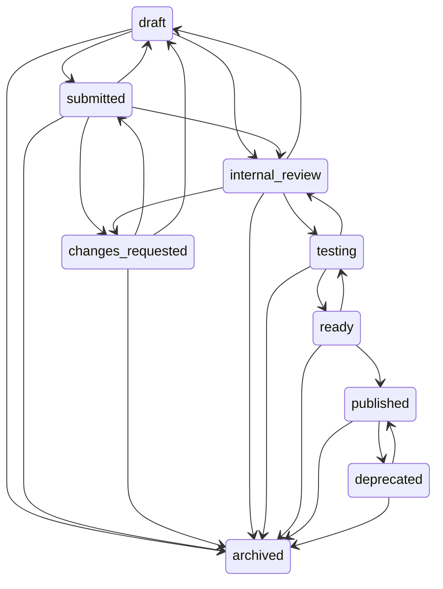
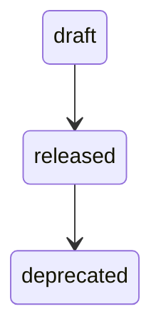
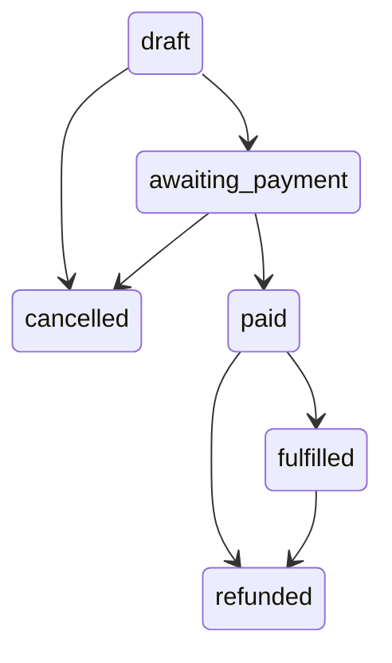
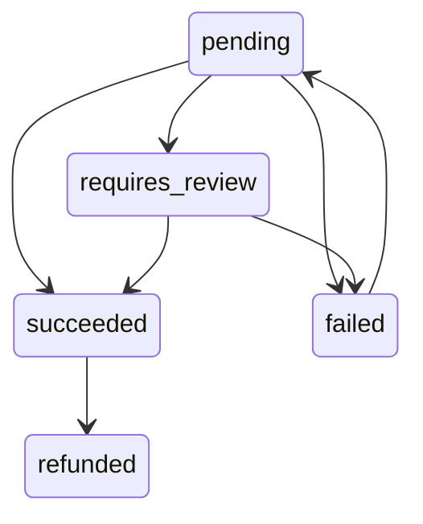
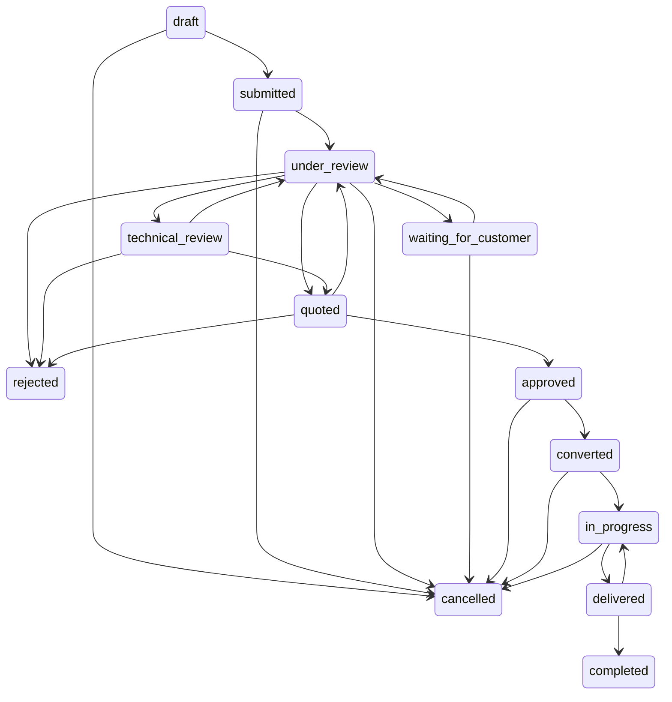
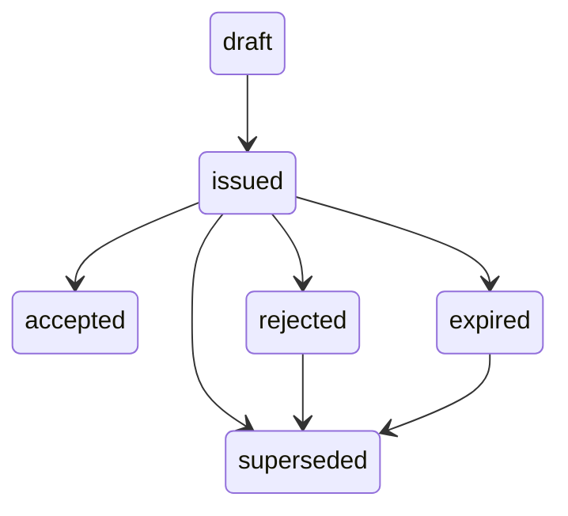
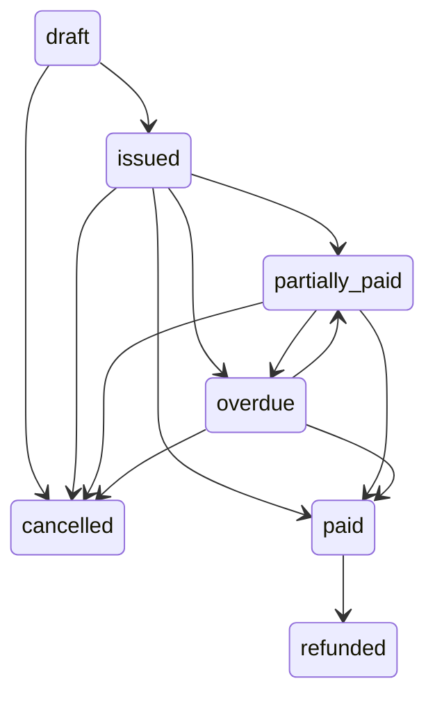
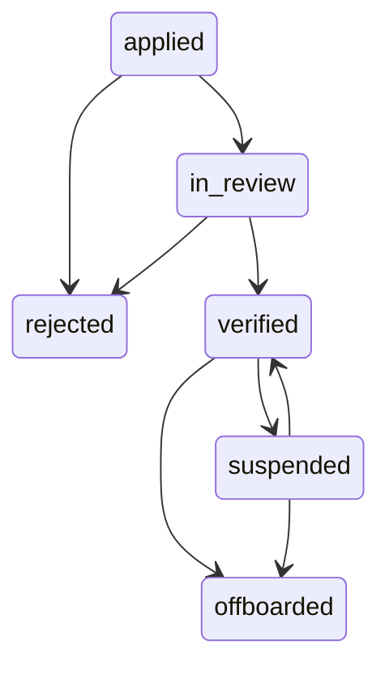
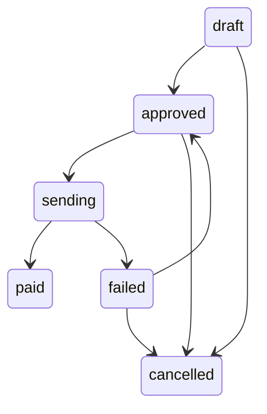

# State machines

> **Generated from `src/lib/db/states.ts` — do not edit by hand.**
> Run `npm run db:docs` after changing a transition map.

Spec §91: *"State transitions must be validated server-side."* The maps in
`states.ts` are that validation. `assertTransition()` is the only sanctioned
way to change a status field — a service writing `{ $set: { status } }`
directly has bypassed the machine, and that is a review failure.

A state with no outgoing transitions is **terminal**. No machine allows a
state to transition to itself: re-entering a state would hide a double-write,
which for `order.paid` means fulfilling twice.

## product

| From | To | |
|---|---|---|
| `draft` | `submitted` · `internal_review` · `archived` |  |
| `submitted` | `internal_review` · `changes_requested` · `draft` · `archived` |  |
| `changes_requested` | `submitted` · `draft` · `archived` |  |
| `internal_review` | `testing` · `changes_requested` · `draft` · `archived` |  |
| `testing` | `ready` · `internal_review` · `archived` |  |
| `ready` | `published` · `testing` · `archived` |  |
| `published` | `deprecated` · `archived` |  |
| `deprecated` | `published` · `archived` |  |
| `archived` | — | **terminal** |

## productVersion

| From | To | |
|---|---|---|
| `draft` | `released` |  |
| `released` | `deprecated` |  |
| `deprecated` | — | **terminal** |

## order

| From | To | |
|---|---|---|
| `draft` | `awaiting_payment` · `cancelled` |  |
| `awaiting_payment` | `paid` · `cancelled` |  |
| `paid` | `fulfilled` · `refunded` |  |
| `fulfilled` | `refunded` |  |
| `cancelled` | — | **terminal** |
| `refunded` | — | **terminal** |

## payment

| From | To | |
|---|---|---|
| `pending` | `succeeded` · `failed` · `requires_review` |  |
| `requires_review` | `succeeded` · `failed` |  |
| `succeeded` | `refunded` |  |
| `failed` | `pending` |  |
| `refunded` | — | **terminal** |

## request

| From | To | |
|---|---|---|
| `draft` | `submitted` · `cancelled` |  |
| `submitted` | `under_review` · `cancelled` |  |
| `under_review` | `waiting_for_customer` · `technical_review` · `quoted` · `rejected` · `cancelled` |  |
| `waiting_for_customer` | `under_review` · `cancelled` |  |
| `technical_review` | `under_review` · `quoted` · `rejected` |  |
| `quoted` | `approved` · `rejected` · `under_review` |  |
| `approved` | `converted` · `cancelled` |  |
| `converted` | `in_progress` · `cancelled` |  |
| `in_progress` | `delivered` · `cancelled` |  |
| `delivered` | `completed` · `in_progress` |  |
| `completed` | — | **terminal** |
| `rejected` | — | **terminal** |
| `cancelled` | — | **terminal** |

## quote

| From | To | |
|---|---|---|
| `draft` | `issued` |  |
| `issued` | `accepted` · `rejected` · `expired` · `superseded` |  |
| `accepted` | — | **terminal** |
| `rejected` | `superseded` |  |
| `expired` | `superseded` |  |
| `superseded` | — | **terminal** |

## invoice

| From | To | |
|---|---|---|
| `draft` | `issued` · `cancelled` |  |
| `issued` | `partially_paid` · `paid` · `overdue` · `cancelled` |  |
| `partially_paid` | `paid` · `overdue` · `cancelled` |  |
| `overdue` | `partially_paid` · `paid` · `cancelled` |  |
| `paid` | `refunded` |  |
| `cancelled` | — | **terminal** |
| `refunded` | — | **terminal** |

## vendor

| From | To | |
|---|---|---|
| `applied` | `in_review` · `rejected` |  |
| `in_review` | `verified` · `rejected` |  |
| `verified` | `suspended` · `offboarded` |  |
| `suspended` | `verified` · `offboarded` |  |
| `rejected` | — | **terminal** |
| `offboarded` | — | **terminal** |

## payout

| From | To | |
|---|---|---|
| `draft` | `approved` · `cancelled` |  |
| `approved` | `sending` · `cancelled` |  |
| `sending` | `paid` · `failed` |  |
| `failed` | `approved` · `cancelled` |  |
| `paid` | — | **terminal** |
| `cancelled` | — | **terminal** |

